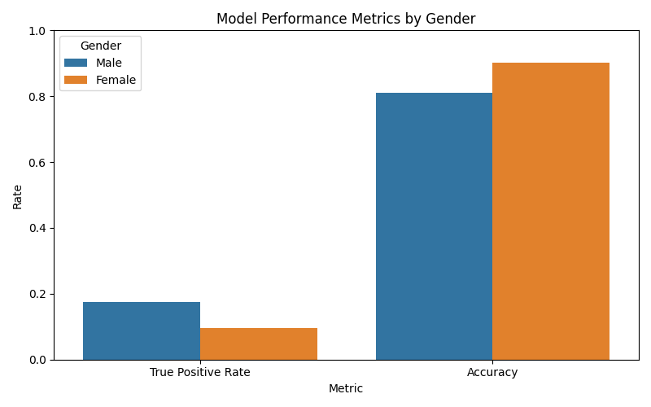
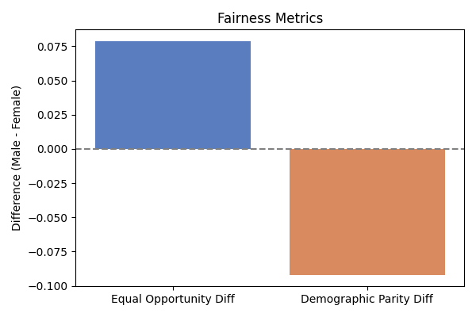
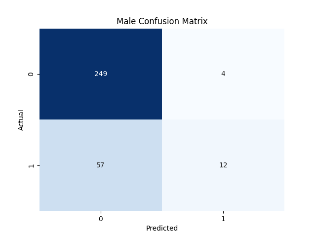

# Predicting Cardiovascular Risk with Fairness in Mind  
**Nathan Egbuna — Summer 2025 Research Project**

This notebook investigates how model performance and fairness vary across gender in predicting 10-year heart disease risk using the Framingham Heart Study dataset.

---

## Dataset  
I used the [Framingham Heart Study Dataset](https://www.kaggle.com/datasets/aasheesh200/framingham-heart-study-dataset), which contains anonymized health data from 4,240 individuals, including:

- Demographics (e.g., age, sex, education)
- Health indicators (e.g., BMI, blood pressure, glucose)
- Outcome: `TenYearCHD` — whether the person developed coronary heart disease within 10 years.

---

## Model
I used scikit-learn to make a Logistic Regression model to predict 10-year CHD risk.

```python
lr_model = LogisticRegression(max_iter=2000)
```

Overall model accuracy: 86.2%

I then evaluated its fairness and error rates across gender groups.

⸻

Fairness Metrics by Gender

I compared True Positive Rate (TPR) and Accuracy betIen males and females to identify disparities in the model’s ability to correctly identify at-risk patients.

TPR and Accuracy by Gender




Equal Opportunity & Demographic Parity Differences
Equal Opportunity Difference (EOD): **0.078**
(Difference in TPR betIen male and female)
Demographic Parity Difference (DPD): **-0.09**
(Difference in positive prediction rates)




⸻

Confusion Matrices by Gender

These show how predictions broke down into true/false positives/negatives by gender.

Male



Female


⸻

Key Findings
	•	Disparity in TPR: The model is better at detecting risk in men (17%) than in women (9.5%).
	•	Accuracy Gap: The model is more accurate for women (90%) than men (81%).
	•	This suggests possible bias due to representation or feature interaction, especially since education level and access to care (which correlate with SES and potentially race) may affect who gets diagnosed and included in the dataset.

⸻

Future Work
	•	Apply rebalancing techniques like SMOTE or reIighting.
	•	Consider intersectional fairness (e.g., by age + gender or education + gender).
	•	Train alternative models and compare fairness trade-offs.
	•	Explore fairness-aware loss functions or post-processing methods.

⸻

How to Run

Clone the repo and open the Colab notebook:

git clone https://github.com/yourusername/your-repo-name.git

Open the notebook in Google Colab and install dependencies, download the dataset, then run the model.
